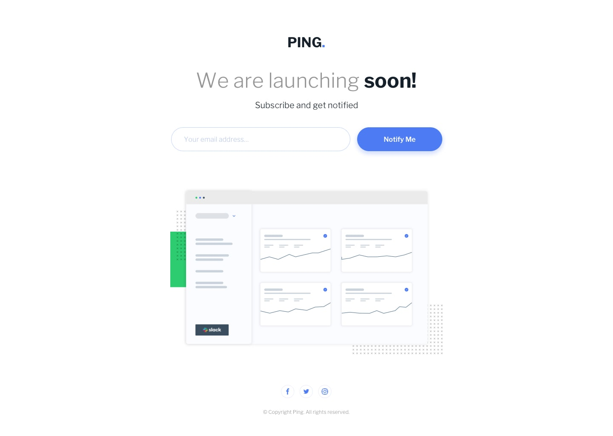

# 🌐 Frontend Mentor - Ping coming soon page

## 📌 Overview

This project is a **responsive static web page** built using:

-   **HTML, Sass, JavaScript**
-   **Regex for email validation**
-   **Modern CSS techniques for responsiveness**

## **Features**

✔ **Fully responsive design** optimized for **mobile (375px) and desktop (1440px)**
✔ **Email validation** to prevent empty or incorrectly formatted inputs
✔ **User-friendly feedback** with error messages for invalid emails
✔ **Success notification** when the email is correctly entered

## 📸 Preview

    
    

## 🌍 Live Demo

Check out the live version of the project here:  
[Live Demo](https://earnest-sunflower-509dd0.netlify.app/)
